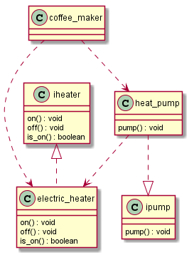

<a href="http://www.boost.org/LICENSE_1_0.txt" target="_blank"></a>
<a href="https://github.com/boost-experimental/di/releases" target="_blank"></a>
<a href="https://travis-ci.org/boost-experimental/di" target="_blank"></a>
<a href="https://ci.appveyor.com/project/krzysztof-jusiak/di" target="_blank"></a>
<a href="https://coveralls.io/r/boost-experimental/di?branch=cpp14" target="_blank"></a>
<a href="http://github.com/boost-experimental/di/issues" target="_blank"></a>

---------------------------------------

Introduction
============

| **Experimental Boost.DI** | |
| - | - |
| Your C++14 header only Dependency Injection library with no dependencies ([__Try it online!__](http://boost-experimental.github.io/di/try_it/index.html)) | <a class="github-button" href="https://github.com/boost-experimental/di" data-style="mega" data-count-href="/boost-experimental/di/stargazers" data-count-api="/repos/boost-experimental/di#stargazers_count" data-count-aria-label="# stargazers on GitHub" aria-label="Star boost-experimental/di on GitHub">GitHub</a> |

<div class="important">
<h3 class="wy-text-neutral"><span class="fa fa-info-circle wy-text-info"></span>&nbsp; Latest Release: <b>v1.0.0</b> (February 22, 2016)</h3>
<a href="../releases" class="btn btn-success" style="margin-bottom:8px;" role="button"><span class="fa fa-download"></span>&nbsp; <b>Download</b></a> &nbsp;&nbsp;&nbsp;&nbsp; <a href="CHANGELOG/index.html" class="btn btn-info" style="margin-bottom:8px;" role="button"><span class="fa fa-reorder"></span>&nbsp; <b>Changelog</b></a> &nbsp;&nbsp;&nbsp;&nbsp; <a href="tutorial/index.html" class="btn btn-warning" style="margin-bottom:8px;" role="button"><span class="fa fa-gear"></span>&nbsp; <b>Tutorial</b></a> &nbsp;&nbsp;&nbsp;&nbsp; <a href="examples/index.html" class="btn btn-danger" style="margin-bottom:8px;" role="button"><span class="fa fa-book"></span>&nbsp; <b>Examples</b></a>
</div>

#What is Dependency Injection?
> "Don't call us, we'll call you", Hollywood principle

**[Dependency Injection](http://www.youtube.com/watch?v=IKD2-MAkXyQ) (DI)** involves passing (injecting) one or more dependencies (or services) to a dependent object (or client) which become part of the client’s state.
It is like the Strategy Pattern, except the strategy is set once, at construction. DI enables loosely coupled designs, which are easier to maintain and test.

> **"Let's make some coffee!"**

<center>[](images/coffee_maker.png)</center>

```cpp
                      No Dependency injection                 | Dependency Injection
                      ----------------------------------------|-------------------------------------------
                      class coffee_maker {                    | class coffee_maker {
                      public:                                 | public:
                          void brew() {                       |   coffee_maker(shared_ptr<iheater> heater
                              heater->on();                   |              , unique_ptr<ipump> pump)
                              pump->pump();                   |         : heater(heater), pump(move(pump))
                              clog << "coffee"! << endl;      |     { }
                              heater->off();                  |
                          }                                   |     void brew() {
                                                              |         heater->on();
                      private:                                |         pump->pump();
                          shared_ptr<iheater> heater =        |         clog << "coffee!" << endl;
                              make_shared<electric_heater>(); |         heater->off();
                                                              |     }
                          unique_ptr<ipump> pump =            |
                              make_unique<heat_pump>(heater); | private:
                      };                                      |     shared_ptr<iheater> heater;
                                                              |     unique_ptr<ipump> pump;
                                                              | };
```

###Do I need Dependency Injection?

* DI provides loosely coupled code (separation of business logic and object creation)
* DI provides easier to maintain code (different objects might be easily injected)
* DI provides easier to test code (fakes objects might be injected)

    * [The Clean Code Talks - Don't Look For Things!](http://www.youtube.com/watch?v=RlfLCWKxHJ0)
    * [A New Type of dependency injection](http://www.youtube.com/watch?v=oK_XtfXPkqw)

###Do I need a DI Framework/Library?

Depending on a project and its scale you may put up with or without a DI library, however, in any project
a DI framework may **free you** from maintaining a following (boilerplate) code...

```cpp
logger logger_;
renderer renderer_;
view view_{renderer_, logger_};
model model_{logger_};
controller controller_{model_, view_, logger_};
user user_{loger_};
app app_{controller_, user_};
```
Notice that **ORDER** in which above dependencies are created is **IMPORTANT** as well as that
**ANY** change in **ANY** of the objects constructor will **REQUIRE** a change in this code!


<br /><br />

DI library, not only let you forget about maintaining above code (See [Create Objects Tree](tutorial.md#1-basic-create-objects-tree)),
but also can help you with...

* Testing it (See [Mocks Provider](extensions.md#mocks-provider))
* Serializing it (See [Serialize](extensions.md#serialize))
* Understand code dependencies (See [UML Dumper](extensions.md#uml-dumper))
* Restrict what types and how they should be created (See [Constructible Policy](user_guide.md#di_constructible))

###Real Life examples?

* [Match-3 Game](https://github.com/modern-cpp-examples/match3)
    * Simple web game in C++14 using SDL2 / Model View Controller / Meta State Machine / Dependency Injection / Range-V3 / Emscripten
        * [Play it online!](http://modern-cpp-examples.github.io/match3)

>

* [Automatic Mocks Injector](https://github.com/krzysztof-jusiak/mocks_injector)
    * Automatically create and inject required mocks to tested classes via constructors

>

* [Experimental Boost.MSM-lite](http://boost-experimental.github.io/msm-lite/)
    * C++14 header only eUML-like Meta State Machine library with no dependencies

###Why Boost.DI?

* Boost.DI has none or minimal run-time overhead (See [Performance](overview.md#performance))
* Boost.DI compiles fast / **Faster than Java-[Dagger2]!** (See [Benchmarks](overview.md#benchmarks))
* Boost.DI gives short diagnostic messages (See [Error messages](overview.md#error-messages))
* Boost.DI is non-intrusive (See [Injections](user_guide.md#injections))
* Boost.DI reduces boilerplate code (See [Create Objects Tree](tutorial.md#1-basic-create-objects-tree))
* Boost.DI reduces testing effort (See [Mocks Provider](extensions.md#mocks-provider))
* Boost.DI gives better control of what and how is created (See [Constructible Policy](user_guide.md#di_constructible))
* Boost.DI gives better understanding about objects hierarchy (See [UML Dumper](extensions.md#uml-dumper))


<br /><br />

###Boost.DI design goals

* Be as fast as possible (See [Performance](overview.md#performance))
* Compile as fast as possible (See [Benchmarks](overview.md#benchmarks))
* Give short and intuitive error messages (See [Error messages](overview.md#error-messages))
* Guarantee object creation at compile-time (See [Create Objects Tree](tutorial.md#1-basic-create-objects-tree))
* Be as non-intrusive as possible (See [Injections](user_guide.md#injections))
* Be easy to extend (See [Extensions](extensions.md))

###Related materials

* [CppNow-2016:](https://cppnow2016.sched.org/event/6Sfx/c14-dependency-injection-library-with-no-overhead-and-compile-time-guarantee-of-object-creation) [C++14 Dependency Injection Library with no overhead and compile time guarantee of object creation](http://boost-experimental.github.io/di/cppnow-2016)

###Acknowledgements
* Thanks to Bartosz Kalinczuk for code review and tips how to improve `Boost.DI`
* Thanks to Sohail Somani for support and tips how to improve `Boost.DI`
* Thanks to Rob Stewart and Robert Ramey for documentation feedback and tips how to improve it

[Dagger2]: https://github.com/google/dagger
